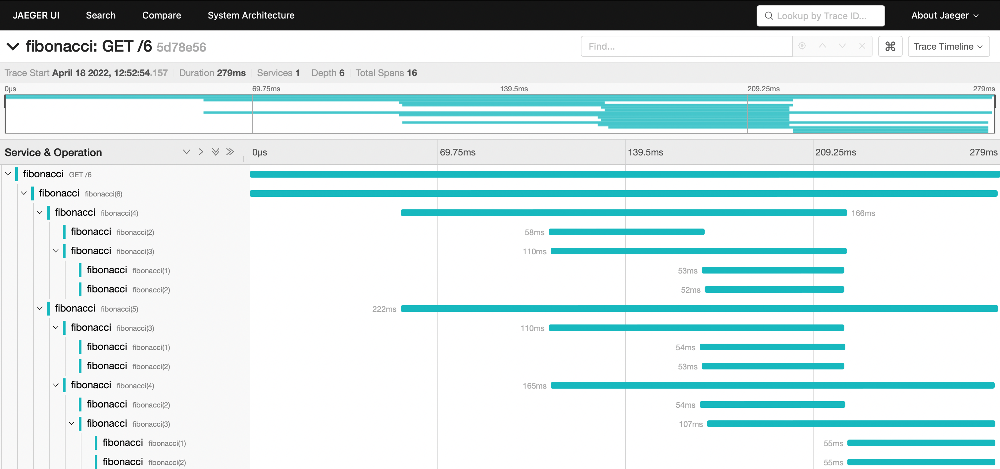

# Fibonacci demo for `IOLocal`-based tracing with trace4cats

A small sample web service that calculates Fibonacci numbers using an inefficient, but parallel algorithm while producing
spans. Demonstrates how tracing can be implemented using `cats.effect.IOLocal` and how the problem of root span creation could be handled (approach not tested yet).

## Usage

### Preparation

The code requires a trace4cats dependency that includes the PR for `IOLocal`: https://github.com/trace4cats/trace4cats/pull/729.
Sonatype snapshots from `0.13.1+20-973c3271` on fulfil this requirement. If you want to test further developments, make sure to publish locally and replace the version in `build.sbt`.

### Run it

To run the service, use `sbt`:

```shell
sbt run
```

As this will not trigger any action other than starting the service and binding it to port 8080, request it via curl:

```shell
curl http://localhost:8080/6
```

The last path segment is the index of the Fibonacci number to calculate. Careful, higher numbers will create a huge amount of spans
and take a while to complete (the computation is slowed down by sleeping in between to provide a real-world trace graph).

## See the results

The service uses the Jaeger integration, so spin up a local instance to see the traces produced. See [https://www.jaegertracing.io/docs/1.33/getting-started/](https://www.jaegertracing.io/docs/1.33/getting-started/) on how to do that, then open [http://localhost:16686](http://localhost:16686) in your browser.

Traces produced by the demo service will then look like this:


